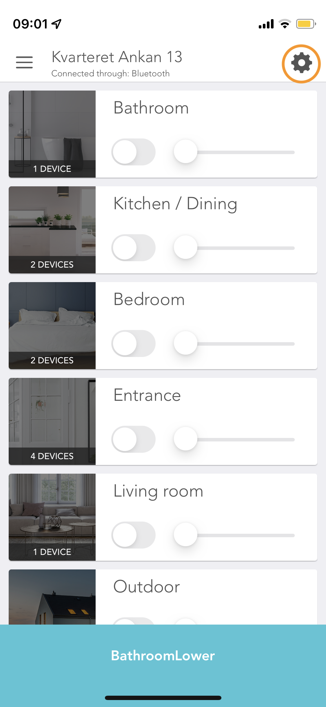
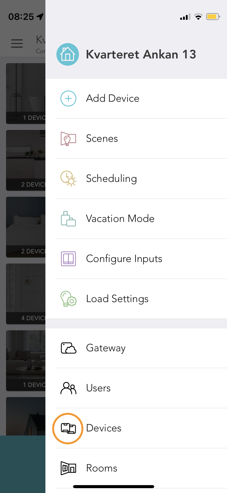
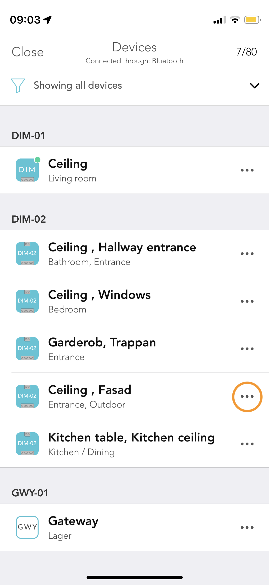
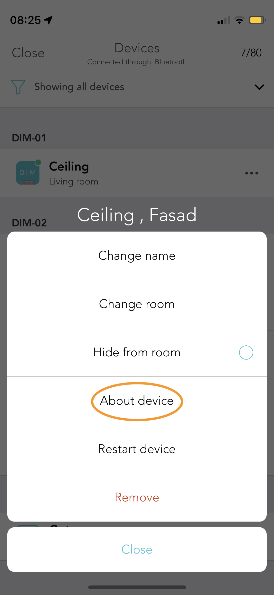
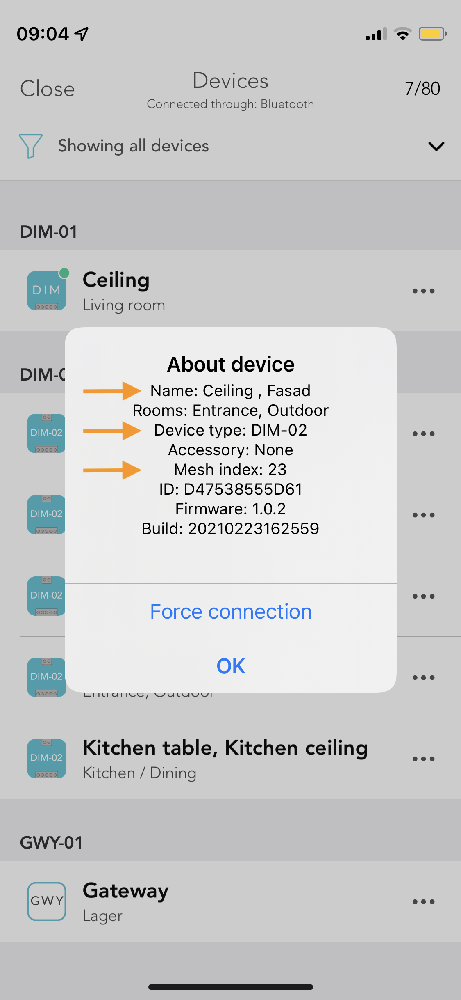

## Getting Device Identifier (Mesh Index) and other info from app

In the case of a DIM-02 as it has 2 dimmers, the mesh index you see in the info popup will be the lower value. Looking at the info view you see two names and one index. 'Ceiling' and 'Fasad', Mesh index 23. This means Ceiling=23 and Fasad=24. 

As for the other single entity devices you simply use the ID.

Home Screen                | Settings Pane             | Devices                   | Device Menu                | Device Info
:-------------------------:|:-------------------------:|:-------------------------:|:-------------------------:|:-------------------------:
  |   |  |  | 

### Homebridge settings

